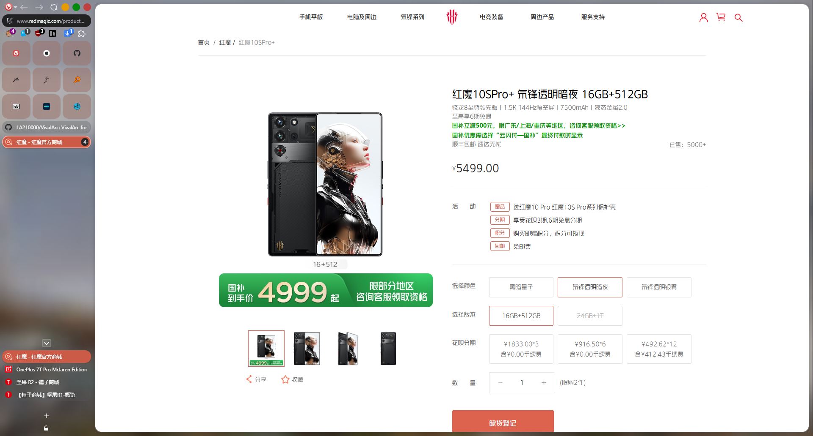
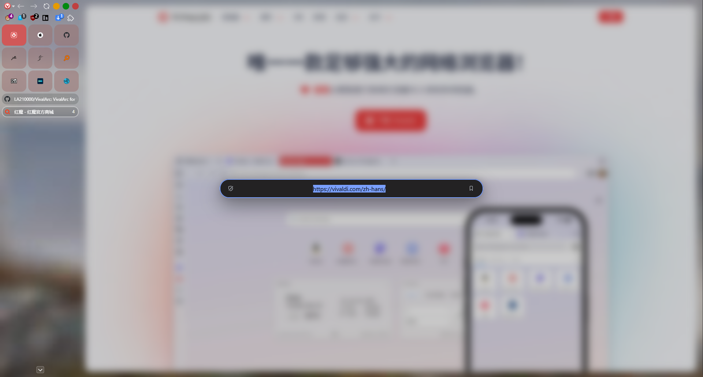

[English](https://github.com/LA210000/VivalArc/blob/master/README.md) | [简体中文](https://github.com/LA210000/VivalArc/blob/master/README.zh-CN.md)

#  VivalArc

Based on:

[KaKi87's phi-for-vivaldi](https://github.com/KaKi87/phi-for-vivaldi)

[2littersofwater's Furui-Phi-Tweaks](https://github.com/2littersofwater/Furui-Phi-Tweaks)

## ✨ Features

- Supported Vivaldi features : 

    UI on left & right sides, theming from themes.vivaldi.net, toggle UI, panels, popups, split tabs ;

- Enhanced Vivaldi features :

    - Pinned tabs : Displayed as icon-only grid ;
    - Stacked tabs : Two-Level Tab Stacks with titles ;
    - Compact mode : Icon-only sidebar, implemented under the "panel toggle" command, keyboard shortcut assignable ;
    - Vivaldi menu icon : Vivaldi menu icon customizable ;
    - Toolbar Icons : Toolbar Icons numbers customizable .

- Additional features :
  
  - Extension Popup : Vertical extensions popup, optional, disabled by default ;
  - Scrollbar : Hide scrollbar, by default ;
  - Window Control Button : Windows or MacOS Styled Buttons, optional ;
  - Workspace Button : Hide workspace button, optional, enabled by default ;
  - Find in Page : Find in Page centered, enabled by default ;
  - Address bar : Floating address bar that centers within the browser window, with center-aligned URL text, optional, enabled by default.

## :camera_flash: Preview

|  |  |  |
| :------------------------: | --------------------------------------- | ------------------------------------- |
|        **Preview**         | **Two-Level Stacked tabs**              | **Floating Address Bar**              |

# :gear: Installation ([video](https://www.youtube.com/watch?v=gt5pZEUbFbM))

1. (If going through onboarding) At the "Choose a style" step, select "Classic" ;
2. Create a folder to download the mod into ;
3. Download the mod by right-clicking [here](https://github.com/LA210000/VivalArc/blob/master/VivalArc.css) then "Save Link As..." to the folder created in step 2 ;
4. Go to `vivaldi:flags` and next to "Allow CSS modifications", switch "Default" to "Enabled" ;
5. Open Vivaldi settings ;
   - Under "General" ➔ "Startup" ➔ "Default Browser", uncheck "Check on Startup" ;
   - (If not gone through onboarding) Under "Appearance" ➔ "Layout Presets", select "Classic" ;
   - (Optionally, recommended on Mac) Under "Appearance" ➔ "Window Appearance", check "Use Native Window" ;
   - Under "Appearance" ➔ "Window Appearance" ➔ "Status Bar", select "Status Info Overlay" or "Hide Status Bar" ;
   - Under "Appearance" ➔ "Custom UI Modifications", open the folder created in step 1 ;
   - Under "Tabs" ➔ "Tabs" ➔ "Tab Bar Position", select "Left" or "Right" ;
   - Under "Tabs" ➔ "Tab Display" ➔ "Tab Options", uncheck "Show Popup Thumbnails" ;
   - Under "Tabs" ➔ "Tab Features" ➔ "Tab Stacking", select "Two-Level" ;
   - (Optionally) Under "Panel" ➔ "Panel Position", select "Left" or "Right" ;
   - Under "Panel" ➔ "Panels" ➔ "Panel Options", check "Floating Panel" ;
   - (Optionally) Under "Address Bar" ➔ "Extension Visibility", check "Expand Hidden Extensions to Drop-Down Menu" ;
   - (Optionally) Under "Keyboard" ➔ "View" ➔ "Panel Toggle", set a shortcut for compact mode ;
6. Quit and relaunch Vivaldi ;
7. Start tweaking the UI ;
   - Right-click in the blank above the URL bar then "Customize Toolbar..." ;
   - Right-click the space items then "Remove from Toolbar" to remove whatever you want ;
   - Then add, move and remove whatever you want, before clicking "Done" ;
8. (Optionally) Star the [GitHub repo](https://github.com/LA210000/VivalArc) .

## :hammer_and_wrench: Customization

While the mod aims to be compatible with as many native customization features as possible (especially sidebar position, side panel position & width, themes, etc.), some had to be moved (e.g. sidebar width), but more were also added, these are located in the file you downloaded, above the source code :

### Enhanced Vivaldi features

| Variable                              | Description                                                  | Value(s)                                | Default         |
| :------------------------------------ | ------------------------------------------------------------ | --------------------------------------- | --------------- |
| `sidebar-width`                       | The width of the sidebar.<sup>(1)</sup>                      | Any number (in pixels)                  | `220`           |
| `compact-sidebar-width`               | Amount of horizontal space for the area containing the whole UI in compact mode.<sup>(1, 2)</sup> | Any number (in pixels)                  | `50`            |
| `is-auto-compact-mode`                | Whether to use auto-compact-mode.                            | `1` = enable<br>`0` = disable           | `0`             |
| `is-vivalarc-menu-icon`               | Whether to show VivalArc's logo in place of Vivaldi's as menu button.<sup>(3)</sup> | `1` = enable<br>`0` = disable           | `1`             |
| `toolbar-column-count`                | Number of toolbar buttons.<sup>(4)</sup>                     | Any quantity                            | `6`             |
| `address-bar-font-size-decrease`      | Lower the character size of the URL to display more of it.   | Any number (in pixels)<br>`0` = disable | `1`             |
| `is-address-bar-unfocused-partial`    | Whether to hide "unimportant"<sup>(5)</sup> parts of the URL when the bar is not focused. | `1` = enable<br>`0` = disable           | `0`             |
| `is-address-bar-unfocused-hide-icons` | Whether to hide icons<sup>(6)</sup> in the URL bar when not focused to see more of the URL. | `1` = enable<br>`0` = disable           | `1`             |
| `is-address-bar-focused-hide-icons`   | Whether to hide icons<sup>(6)</sup> in the URL bar when focused to see more of the URL. | `1` = enable<br>`0` = disable           | `0`             |
| `pinned-column-count`                 | Number of pinned tabs per row.                               | Any quantity                            | `3`             |
| `webview-border`                      | Amount of space around the page content.<sup>(7)</sup>       | Any number (in pixels)<br>`0` = disable | `10`            |
| `webview-border-radius`               | Round the corners of the page content.<sup>(8)</sup>         | Any quantity<br>`0` = disable           | `12`            |
| `webview-shadow-size`                 | Amount of shadow around the page content.<sup>(9)</sup>      | Any number (in pixels)<br>`0` = disable | `10`            |
| `webview-shadow-color`                | Color of shadow around the page content.                     | Comma-separated RGBA values             | `0, 0, 0, 0.25` |

<sup>(1)</sup> Unfortunately, the sidebar cannot be resized by drag-and-drop.<br>
<sup>(2)</sup> On Mac, recommended value is `90` when using non-native window controls on left side.<br>
<sup>(3)</sup> You can replace your own icon.png (or other image format) in root folder as you wish.<br>
<sup>(4)</sup> Unfortunately, the toolbar cannot have more than one row (unless hard-coded to do so, trust me I tried hard).<br>
<sup>(5)</sup> Path and query parameters.<br>
<sup>(6)</sup> Except the following indicators : (in)valid HTTP(S), obfuscated domain name, loading.<br>
<sup>(7)</sup> Reduces page content area. When enabled, recommended value is `10`. A lower value will reveal an unavoidable page content width inconsistency between normal & split tabs.<br>
<sup>(8)</sup> When enabled, default value is `12`.<br>
<sup>(9)</sup> To copy Zen Browser, default value is `10`.

### Additional features

| Variable                                      | Description                                                  | Value(s)                                                     | Default   |
| --------------------------------------------- | ------------------------------------------------------------ | ------------------------------------------------------------ | --------- |
| `is-individual-tiled-tab-header`              | Add a separate top title bar with a webpage link for each individual screen in Vivaldi's Tiled Tabs. | `1` = enable<br/>`0` = disable                               | `0`       |
| `is-hide-window-controls`                     | Hide Window Control Button.                                  | `1` = enable<br/>`0` = disable                               | `0`       |
| `is-hide-content-blocker`                     | Hide the Vivaldi's built-in "Content Blocker (Ad Blocker)" icon. | `1` = enable<br/>`0` = disable                               | `1`       |
| `hide-workspace-button`                       | Hide Workspace Button.                                       | `1` = enable<br>`0` = disable                                | `1`       |
| `custom-window-controls`                      | Beautify Window Control Button Group.                        | `0` = disable<br>`1` = Stylized Windows<br>`2` = Mac OS Style | `2`       |
| `custom-window-controls-minimize-color`       | Color of the Minimize Button.                                | Any Hex values                                               | `#E69B00` |
| `custom-window-controls-maximize-color`       | Color of the Maximize Button.                                | Any Hex values                                               | `#028A0F` |
| `custom-window-controls-close-color`          | Color of the Close Button.                                   | Any Hex values                                               | `#BF4040` |
| `custom-window-controls-more-toolbar-space`   | Compensation for using a Stylized Window Control Group, more room to put toolbar buttons. | `1` = enable<br>`0` = disable                                | `0`       |
| `custom-window-controls-windows-style-height` | Customization to make the Stylized Window buttons longer or shorter. | Any number (in pixels)                                       | `20`      |
| `vertical-extensions`                         | Enable or Disable Vertical Extensions.                       | `1` = enable<br>`0` = disable                                | `0`       |
| `custom-simplified-downloads`                 | Enable or Disable Simplified Downloads List for Address Bar Toolbar Button. | `1` = enable<br>`0` = disable                                | `1`       |
| `custom-simplified-downloads-files`           | Number of files displayed in the Downloads List.<sup>(10)</sup> | Any quantity                                                 | `7`       |
| floating-address-bar                          | Show a floating address bar centered within the browser window. | `1` = enable<br/>`0` = disable                               | `1`       |

<sup>(10)</sup> Minimum is 4 items, i could not make it work to have below 4 items in the list.

Applying modifications requires restarting Vivaldi.

## 🔧 Troubleshooting

- Double check Vivaldi settings as per installation step ;
- Find potentially incompatible settings by comparing with an empty profile ;
- You may disable VivalArc by setting the tab bar position to top or bottom or toggling the tab bar off ;
- Simultaneously using VivalArc with another CSS mod is not supported.

## :link: Related projects

- [ImMainTheme/ArchyVivaldi](https://github.com/ImMainTheme/ArchyVivaldi)
- [tovifun/VivalArc](https://github.com/tovifun/VivalArc)
- [(Address Bar + Title Bar + Status Bar) = Docked to side | Vivaldi Forum](https://forum.vivaldi.net/topic/80588/address-bar-title-bar-status-bar-docked-to-side)
- [HKayn/vivaldi-vh](https://github.com/HKayn/vivaldi-vh)

## :technologist: Development notes

Guide : [Customizing Vivaldi’s UI with CSS mods - gabevilela.vivaldi.net](https://gabevilela.vivaldi.net/2020/12/26/guide-customizing-vivaldis-ui-with-css-mods/)

DevTools URL : `vivaldi://inspect/#apps`

DOM structure :

```
#browser.linux.win.mac.minimal-ui.fullscreen.tabs-left.tabs-right
├─ [aria-label="Address"]
│  ├─ .vivaldi
│  ├─ .button-toolbar
│  ├─ .UrlBar-AddressField
│  └─ .toolbar-extensions
├─ [aria-label="Panels"]
│  └─ .button-toolbar.button-toolbar-webpanel
├─ .panel-group
├─ [name="WorkspaceButton"]
├─ #tabs-container
│  └─ .tab-strip
│     ├─ .tab-position.is-pinned
│     │  └─ .tab-wrapper.active.group
│     │     ├─ .tab.pinned.active.tab-group
│     │     │  └─ .tab-header
│     │     │     ├─ .favicon
│     │     │     ├─ .title
│     │     │     └─ .close
│     │     └─ .tab-group-indicator
│     │        └── .tab-indicator.active
│     ├─ .separator
│     └─ .newtab
└─ #webview-container
```

---

© 2026 — LA210000<br>
Released under the [MIT license](https://opensource.org/license/mit).
