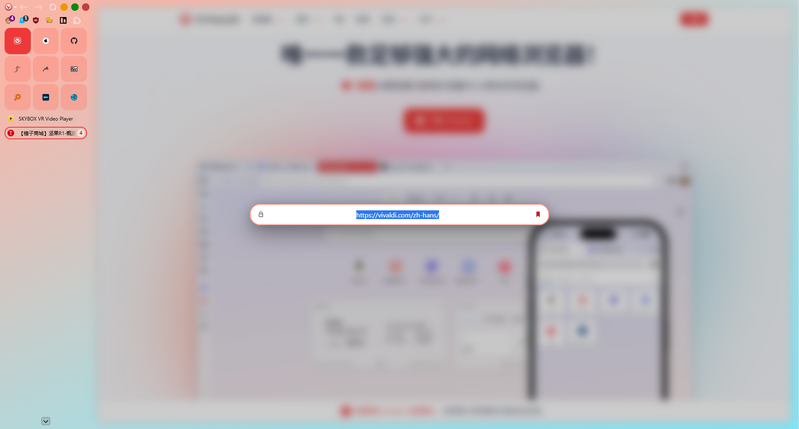

[English](https://github.com/LA210000/VivalArc/blob/master/README.md) | [简体中文](https://github.com/LA210000/VivalArc/blob/master/README.zh-CN.md)

#  VivalArc

本项目基于:

[KaKi87's phi-for-vivaldi](https://github.com/KaKi87/phi-for-vivaldi)

[2littersofwater's Furui-Phi-Tweaks](https://github.com/2littersofwater/Furui-Phi-Tweaks)

## ✨ 功能

- 支持的 Vivaldi 功能：

    标签栏位置居左侧/右侧，来自 themes.vivaldi.net 的主题，切换用户界面、面板、弹出窗口、拆分标签页；

- Vivaldi 增强功能：

    - 固定标签页：以网格图标显示固定标签页；

    - 标签栈 : 显示标题的两级式标签栈；

    - 紧凑模式：仅显示图标样式侧边栏，通过“面板”开关命令实现，可分配键盘快捷键；

    - Vivaldi 菜单图标：可自定义的 Vivaldi 菜单图标；

    - 工具栏图标：可自定义数量的工具栏图标。

- 附加功能 :
  
  - 扩展弹窗：垂直扩展弹窗，可选，默认关闭；
  - 滚动条：默认隐藏滚动条；
  - 窗口控制按钮：Windows 或 MacOS 样式按钮，可选；
  - 工作区按钮：隐藏工作区按钮，可选，默认启用；
  - 在页面中查找：居中显示在页面中查找，默认启用；
  - 地址栏：浏览器窗口居中显示的浮动地址栏，URL 文本居中对齐，可选，默认启用。

## :camera_flash: 预览

|  |  |  |
| :------------------------: | ----------------------------------------- | --------------------------------------- |
|          **预览**          | **两级式标签栈**                          | **浮动地址栏**                          |

# :gear: 安装 ([视频](https://www.youtube.com/watch?v=gt5pZEUbFbM))

1. （新用户初始化设置）在“选择样式”步骤中，选择“经典”；
2. 新建一个文件夹以存放下载的 mod；
3. 右键点击 [here](https://github.com/LA210000/VivalArc/blob/master/VivalArc.css) 选择 "链接另存为..." 将文件 VivalArc.css 另存到步骤 2 中新建的文件夹 ;
4. 浏览器地址栏访问 `vivaldi:flags` 并搜索 "Allow CSS modifications"，将右侧 "Default" 切换为 "Enabled" ;
5. 打开 Vivaldi 设置 ;
   - “一般” ➔ “启动” ➔ “默认浏览器”，取消选中“在启动时检查”；
   - （非新用户初始化设置）“外观” ➔ “预设外观” 选择 “经典”；
   - （可选，Mac 用户推荐开启）“外观” ➔ “窗口外观” 选中“使用原生窗口”；
   - “外观” ➔ “窗口外观” ➔ ”状态栏“，选中”悬浮状态信息“或”隐藏状态栏“；
   - “外观”  ➔ “自定义外观模组”，选择步骤 2 新建的文件夹；
   - “标签页” ➔ “标签页” ➔ “标签栏位置”，选中”左侧“或”右侧“；
   - “标签栏” ➔ “标签页显示” ➔ “标签页选项”，取消选中 “显示弹出缩略图”；
   - “标签栏” ➔ “标签栏功能” ➔ “标签栈”，选中 ”两级式“；
   - （可选）“面板” ➔ “面板位置”，选中”左侧“或”右侧“；
   - “面板” ➔ “面板” ➔ “面板选项”，选中“悬浮面板”；
   - （可选）“地址栏” ➔ “扩展可见性”，选中”下拉菜单展开隐藏扩展“；
   - （可选）“键盘” ➔ “查看” ➔ “面板”，为紧凑模式设置快捷键；
6. 退出并重启 Vivaldi；
7. 开始调整用户界面 ;
   - 在地址栏上方的空白处单击鼠标右键，然后选择“自定义工具栏...”；
   - 右键单击空间项目，然后选择“从工具栏删除”任何你想移除的按钮；
   - 添加、移动或移除任何按钮，最后点击”完成“；
8. （可选）给我的 [GitHub 项目](https://github.com/LA210000/VivalArc) 点个 star。

## :hammer_and_wrench: 自定义

虽然该 mod 旨在尽可能兼容更多原生自定义功能（特别是侧边栏位置、侧面板位置和宽度、主题等），但有些功能不得不进行调整（例如侧边栏宽度），同时也新增了一些功能，这些功能位于您下载的文件中，在源代码的上方：

### Vivaldi 增强功能

| 变量                                  | 描述                                                         | 值                                    | 默认值          |
| :------------------------------------ | ------------------------------------------------------------ | ------------------------------------- | --------------- |
| `sidebar-width`                       | 侧边栏宽度<sup>(1)</sup>                                     | 任意数值 (单位：pixels)               | `220`           |
| `compact-sidebar-width`               | 紧凑模式下的侧边栏宽度<sup>(1, 2)</sup>                      | 任意数值 (单位：pixels)               | `50`            |
| `is-auto-compact-mode`                | 启用自动紧凑模式                                             | `1` = 启用<br>`0` = 禁用              | `0`             |
| `is-vivalarc-menu-icon`               | 使用 VivalArc's logo 替代 Vivaldi 原生的菜单按钮<sup>(3)</sup> | `1` = 启用<br/>`0` = 禁用             | `1`             |
| `toolbar-column-count`                | 工具栏图标数量<sup>(4)</sup>                                 | 任意数值                              | `6`             |
| `address-bar-font-size-decrease`      | 降低 URL 的字符大小以显示更多内容                            | 任意数值 (单位：pixels)<br>`0` = 禁用 | `1`             |
| `is-address-bar-unfocused-partial`    | 地址栏未获得焦点时隐藏 URL 中“不重要”<sup>(5)</sup>的部分    | `1` = 启用<br/>`0` = 禁用             | `0`             |
| `is-address-bar-unfocused-hide-icons` | 地址栏未获得焦点时隐藏 URL 中“的图标<sup>(6)</sup>           | `1` = 启用<br/>`0` = 禁用             | `1`             |
| `is-address-bar-focused-hide-icons`   | 地址栏获得焦点时隐藏 URL 中“的图标<sup>(6)</sup>以显示更多内容 | `1` = 启用<br/>`0` = 禁用             | `0`             |
| `pinned-column-count`                 | 固定标签页的列数                                             | 任意数值                              | `3`             |
| `webview-border`                      | 页面内容边距<sup>(7)</sup>                                   | 任意数值(单位：pixels)<br>`0` = 禁用  | `10`            |
| `webview-border-radius`               | 页面内容圆角<sup>(8)</sup>                                   | 任意数值<br>`0` = 禁用                | `12`            |
| `webview-shadow-size`                 | 页面内容阴影大小<sup>(9)</sup>                               | 任意数值 (单位：pixels)<br>`0` = 禁用 | `10`            |
| `webview-shadow-color`                | 页面内容阴影颜色                                             | 逗号（英文）分隔的 RGBA 值            | `0, 0, 0, 0.25` |

<sup>(1)</sup> 很遗憾，侧边栏无法再通过拖拽来调整大小。<br>
<sup>(2)</sup> 在 Mac 上，如果左侧使用非原生窗口控件，建议值为 `90`。<br>
<sup>(3)</sup> 可以任意替换你想要的 icon.png（或其他图像格式）。<br>
<sup>(4)</sup> 遗憾的是，工具栏不能超过一行（除非硬编码，相信我，我努力尝试过）。<br>
<sup>(5)</sup> 路径与查询参数。<br>
<sup>(6)</sup> 以下除外：有效/无效的 HTTP(S)、模糊域名、加载中。<br>
<sup>(7)</sup> 会减少页面内容区域大小。若启用此功能，建议值为 `10`。值过低会导致普通标签页和拆分标签页之间出现不可避免的页面内容宽度不一致。<br>
<sup>(8)</sup> 若启用，建议值为 `12`。
<sup>(9)</sup> 为了模仿 Zen Browser，默认值为 `10`.

### 附加功能

| 变量                                          | 描述                                                         | 值                                                           | 默认值    |
| --------------------------------------------- | ------------------------------------------------------------ | ------------------------------------------------------------ | --------- |
| `is-individual-tiled-tab-header`              | 为 Vivaldi 的平铺标签页中的每一个独立分屏，单独添加一个带有网页链接的顶部标题栏 | `1` = 启用<br/>`0` = 禁用                                    | `0`       |
| `is-hide-window-controls`                     | 隐藏 Windows 控制按钮                                        | `1` = 启用<br/>`0` = 禁用                                    | `0`       |
| `is-hide-content-blocker`                     | 隐藏 Vivaldi 浏览器自带的“内容拦截器（广告拦截）”图标        | `1` = 启用<br/>`0` = 禁用                                    | `1`       |
| `hide-workspace-button`                       | 隐藏工作区按钮                                               | `1` = 启用<br/>`0` = 禁用                                    | `1`       |
| `custom-window-controls`                      | 美化窗口控制按钮                                             | `0` = 禁用<br>`1` = 个性化 Windows 风格<br>`2` = Mac OS 风格 | `2`       |
| `custom-window-controls-minimize-color`       | 最小化按钮的颜色                                             | 任意 Hex 值                                                  | `#E69B00` |
| `custom-window-controls-maximize-color`       | 最大化按钮的颜色                                             | 任意 Hex 值                                                  | `#028A0F` |
| `custom-window-controls-close-color`          | 关闭按钮的颜色                                               | 任意 Hex 值                                                  | `#BF4040` |
| `custom-window-controls-more-toolbar-space`   | 使用个性化窗口控制按钮的补偿机制，为工具栏按钮留出更多空间   | `1` = 启用<br/>`0` = 禁用                                    | `0`       |
| `custom-window-controls-windows-style-height` | 窗口控制按钮的高度                                           | 任意数值 (单位：pixels)                                      | `20`      |
| `vertical-extensions`                         | 启用垂直扩展列表                                             | `1` = 启用<br/>`0` = 禁用                                    | `0`       |
| `custom-simplified-downloads`                 | 简化工具栏按钮的下载列表                                     | `1` = 启用<br/>`0` = 禁用                                    | `1`       |
| `custom-simplified-downloads-files`           | 下载列表显示的文件数量<sup>(10)</sup>                        | 任意数值                                                     | `7`       |
| floating-address-bar                          | 浮动地址栏，浏览器窗口居中显示，URL 文本居中对齐             | `1` = 启用<br/>`0` = 禁用                                    | `1`       |

<sup>(10)</sup> 最少为 4 件，数量低于 4 时无法。

应用修改需要重启 Vivaldi。

## 🔧 故障排除

- 请按照安装步骤再次检查 Vivaldi 设置；
- 通过与空白配置文件进行比较，查找可能不兼容的设置；
- 您可以通过将标签栏位置设置为顶部或底部，或者关闭标签栏来禁用 VivalArc；
- VivalArc 和其他 CSS 模组无法同时生效。

## :link: 相关项目

- [ImMainTheme/ArchyVivaldi](https://github.com/ImMainTheme/ArchyVivaldi)
- [tovifun/VivalArc](https://github.com/tovifun/VivalArc)
- [(Address Bar + Title Bar + Status Bar) = Docked to side | Vivaldi Forum](https://forum.vivaldi.net/topic/80588/address-bar-title-bar-status-bar-docked-to-side)
- [HKayn/vivaldi-vh](https://github.com/HKayn/vivaldi-vh)

## :technologist: 开发着笔记

指南 : [Customizing Vivaldi’s UI with CSS mods - gabevilela.vivaldi.net](https://gabevilela.vivaldi.net/2020/12/26/guide-customizing-vivaldis-ui-with-css-mods/)

开发者工具 URL : `vivaldi://inspect/#apps`

DOM 结构 :

```
#browser.linux.win.mac.minimal-ui.fullscreen.tabs-left.tabs-right
├─ [aria-label="Address"]
│  ├─ .vivaldi
│  ├─ .button-toolbar
│  ├─ .UrlBar-AddressField
│  └─ .toolbar-extensions
├─ [aria-label="Panels"]
│  └─ .button-toolbar.button-toolbar-webpanel
├─ .panel-group
├─ [name="WorkspaceButton"]
├─ #tabs-container
│  └─ .tab-strip
│     ├─ .tab-position.is-pinned
│     │  └─ .tab-wrapper.active.group
│     │     ├─ .tab.pinned.active.tab-group
│     │     │  └─ .tab-header
│     │     │     ├─ .favicon
│     │     │     ├─ .title
│     │     │     └─ .close
│     │     └─ .tab-group-indicator
│     │        └── .tab-indicator.active
│     ├─ .separator
│     └─ .newtab
└─ #webview-container
```

---

© 2026 — LA210000<br>
Released under the [MIT license](https://opensource.org/license/mit).
